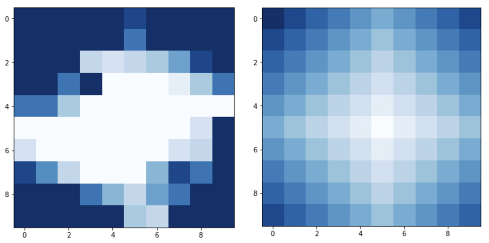

Model: Bike Distribution in a Bike-Sharing System Optimization (BIKESHARE)
=============================================================================

Description:
------------
A bike-sharing system is a public transportation service where bikes are available for 
shared used by individual users at low cost. Thousands of cities throughout the world
nowadays have incorporated a city-wise bike-sharing system. The model simulates a docking 
system, where users are allowed to rent from a dock (i.e. a bike rack) and return at any 
docks within the system. 

Let there be a square grid of dimension :math:`d` and thus :math:`d^2` number of bike 
docks. Let :math:`p_e` be the penalty incurred each time a renter finds a dock empty, and 
:math:`p_f` be the penalty incurred each time a user wants to return a bike and finds it 
full. 

Let :math:`x_1, x_2,..., x_{d^2}` be the number of bikes at each station, corresponding to 
station 1 to station :math:`d^2`. 

Users (bike-riders) arrive at station :math:`i` following a nonhomogenous Poisson process 
with morning rate :math:`\lambda^j_1`, mid-day rate :math:`\lambda^j_2`, and evening rate 
:math:`\lambda^j_3` users per hour. Each replication simulates a day of service, where day 
length :math:`T = 16` hours. In the first 5 hours, each station follows the morning 
arrival rates; in the second 6 hours, each station follows the noon arrival rates; and in 
the last 5 hours the evening rates. This is a model the morning and evening rush during 
a typically working day in a metropolitan city. 

Sources of Randomness:
----------------------
Users arrives at each station independently following a nonhomogenous Poisson process with 
a piece-wise constant lambda function. The ride time of each user follows a gamma distribution 
in proportion to the Manhattan distance between the source station and the destination 
station of the user. The destination is generated randomly with probability in proportion 
to how small the current arrival rate is (i.e., we convert the arrival rates of all stations 
to a probability distribution by first taking in inverse of each arrival rate and then normalizing
it such that they sum up to 1). 

Model Factors:
--------------
* map_dim: Dimsion of the squared grid city map. 

    * Default: 5

* num_bikes: Total number of bikes in the city. 

    * Default: 375

* num_bike_start: (decision var) Number of bikes at each station at the beginning of the day. 

    * Default: tuple([15] * 25)
  
* day_length: The length of a day in operation in hours.

    * Default: 16

* station_capacities: The capacity of each corresponding stations. 

    * Default: 18

* empty_penalty_constant: The per-time penalty rate for when when a rider borrowing finds a station with no bike.

    * Default: 50.0

* full_penalty_constant: The per-time penalty rate for when a rider returning a bike finds a station full. 
    * Default: 50.0

* gamma_mean_const: Scaler constant for the mean time it takes the user to return the bike. 

    * Default: 1/3

* gamma_variance_const: Scaler constant for the variance of time it takes the user to return the bike. 

    * Default: 1/2

Respones:
---------
* penalty: The total penalty incurred during the operation day. 

References:
===========
N/A

Optimization Problem: Maximize Profit (IRONORE-1)
=================================================

Decision Variables:
-------------------
* num_bike_start

Objectives:
-----------
Minimize penalty over day_length time periods.

Constraints:
------------
All decision variables should be non-negative and less than capacity.

Problem Factors:
----------------
* budget: Max # of replications for a solver to take

  * Default: 1000

Fixed Model Factors:
--------------------
* N/A

Starting Solution: 
------------------
* initial_solution: :math:`[15, 15, 15, ..., 15]`

Random Solutions: 
-----------------
* :math:`x_1`: Sample an lognormal random variate with 2.5- and 97.5-percentiles of 10 and 200.

Optimal Solution:
-----------------
This problem cannot be solved exactly. However, we could get some hint on where the optimal solution 
might lie using our gradient approximation. 

Because our goal is to minimize the number of times where rider cannot grab or return a bike due to 
a station having no bike or full, we constructed a psuedo-gradeint :math:`g` with elements 
:math:`g_1, g_2,..., g_{d^2}`. For each station :math:`i`, let :math:`n^full_i` denote the number of 
times during a simulation day where a rider returning a bike finds their destination full, and 
:math:`n^empty_i` denote the number of times during a simulation day where a rider grabbing a bike finds
no bike at source station. Let :math:`g_i` = :math:`n^full_i` - :math:`n^empty_i` for each station 
:math:`i`. 

Using this gradient, we adapted ADAM such that it outputs integer solution within our constraint domain. 
Through our experiments, the integer-ADAM converges to a visualizable optimal as shown below: 

On the left is the optimal bike distribution found by ADAM, and on the right is the arrival rates at
the start of the day (later in the day the arrival rates flips, see above for the formulation description). 
By intuition, we could see that the integer-ADAM gives us a solution that is close to what we think 
to be optimal, with a lot of bikes at stations with high arrival rates and little bikes at stations with low 
arrival rates. 

To check that the integer-ADAM solution is close to optimal (i.e. whether the psuedo-gradient is good 
enough), we hypothesized that the optimal solution should be symmetric around the center of the grid 
as the arrival rates are. We then do a grid search over all possible solutions in a 5-by-5 grid. It turns out 
that the integer-ADAM solution is within 0.5% percent the grid-search optimal. Our problem is thus fully-tested, 
and the psuedo-gradient is also provided as the problem gradient for other testing purposes. 

Optimal Objective Function Value:
---------------------------------
Unknown
