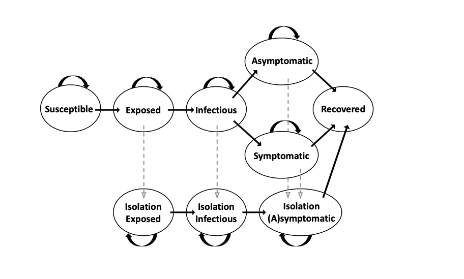

Model: COVID-19 Disease Progression with Testing and Vaccination (COVID)
=================================================================

Description:
------------
COVID-19 is a contagious respiratory disease with a high trasmission rate. A college campus implements
regular survelliance testing to identify, isolate, and reduce disease spread. However, the model can also
be generalized and simulated the interaction among any given groups of people.
The initial prevalance level of the disease is :math:`init_infect_percent`. The population is divided 
into different groups with intra-group interaction matrix :math:`inter_rate`. There is a probability of :math:`p_trans` (or :math:`p_trans_vac`) 
transmissions per interaction. The transmission rate per individual can be calculated by multiplying 
:math:`inter_rate` by :math:`p_trans` (or :math:`p_trans_vac`). The disease progression for each individual follows the following semi-Markov process:

Clarifications: 

1. All recovered people will not be infected again;

2. In the exposed state, people cannot infect others; during the infectious/asymptomatic state, people can infect other;

3. Remove all infected individuals (except those in symptomatic state) to isolation if they are tested and have result of positive at each day;

4. All individuals in symptomatic state will be isolated;

5. For individuals in isolation state, assume they follow the same disease progression;

6. Given being infected, the transmission probabilities for vaccinated and non-vaccinated individuals are different;

7. Given being infected, receiving vaccination does influence the probability of being asymptomatic but not influence process of illness; 

8. Assume all the N vaccinations are received at the beginning of the cycle, and we do not consider multiple doses here;

9. Assume all initial infectious people are unvaccinated;

10. Assume all symptomatic people are isolated;

11. Assume all testing happens at the end of the day. (i.e. people will be isolated at the end of the day); 

12. At day :math:`t`, for individuals who will transit to next the state in day :math:`t+1`, assume they will not be tested at day :math:`t` but at day :math:`t+1`;

13. At the end of isolation, individuals will return to recovered state.

The simulation is generated as follows:

1. For each day in :math:`n` and for each group :math:`g`, generate newly exposed individuals.

2. At day :math:`t`, for each state, each group :math:`g`, consider the newly coming individuals and the remaining scheduled people:

    (a) Schedule for newly coming individuals: generate :math:`day_exp` number of days remaining in exposed and :math:`gen_exp_num` number of people who are going to move to infectious state at date :math:`day_exp + t`.

    (b) Generate isolation starting schedule for the scheduled exposed people:  generate day :math:`day_move_iso_exp` and :math:`num_iso_exp` number of people who are going to move to isolation at date :math:`day_move_iso_exp + t`.

    (c) Remove the scheduled isolated people from the scheduled exposed group and the total exposed group.

    (d) At the end of :math:`day_exp + t`, the remaining scheduled exposed people are going to move to infectious.

    (e) Generate the schedule for exposed isolated people: generate :math:`day_exp_iso` number of days remaining in exposed state and :math:`gen_exp_num_iso` number of people who are going to move to infectious isolation state at date :math:`day_exp_iso + t`.

    (f) At the end of :math:`day_exp_iso + t`, the :math:`gen_exp_num_iso` number of isolated exposed individuals are going to move to infectious isolation state.

    (g) Schedule for newly coming individuals to infectious state: generate :math:`day_inf` number of days remaining in infectious and :math:`gen_inf_num` number of people who are going to move to symptomatic /asymptomatic state at date :math:`day_inf + t`.

    (h) Generate isolation starting schedule for the scheduled infectious people: generate day :math:`day_move_iso_inf` and :math:`num_iso_inf` number of people who are going to move to isolation at date :math:`day_move_iso_inf + t`.

    (i) Remove the scheduled isolated people from the scheduled infectious group and the total infectious group.

    (j) At the end of :math:`day_inf + t`, generate the number of asymptomatic people from the remaining scheduled infectious people, move them to asymptomatic state. Symptomatic people are all going to symptomatic isolation.

    (k) Generate the schedule for infectious isolated people: generate :math:`day_inf_iso` number of days remaining in infectious state and :math:`gen_inf_num_iso` number of people who are going to move to symptomatic /asymptomatic isolation state at date :math:`day_inf_iso + t`.

    (l) At the end of :math:`day_inf_iso + t`, generate the number of symptomatic and asymptomatic people from the :math:`gen_inf_num_iso` number of isolated infectious people, move them to symptomatic/asymptomatic isolation state.

    (m) Generate the schedule for symptomatic individuals: generate :math:`day_sym` number of days remaining in symptomatic state and :math:`gen_sym_num` number of people who are going to move to recover at date :math:`day_sym + t`.

    (n) Generate the schedule for asymptomatic individuals: generate :math:`day_asym ` number of days remaining in asymptomatic state and :math:`gen_asym_num` number of people who are going to move to recover at date :math:`day_asym + t`.

    (o) Generate isolation starting schedule for the scheduled asymptomatic people: generate day :math:`day_move_iso_asym` and :math:`num_iso_asym` number of people who are going to move to asymptomatic isolation state at date :math:`day_move_iso_asym + t`.

    (p) Remove the scheduled isolated asymptomatic people from the scheduled asymptomatic group and the total asymptomatic group.

    (q) At the end of :math:`day_asym + t`, the remaining scheduled asymptomatic people are going to move to recover state.

    (r) Generate the schedule for asymptomatic isolated individuals: generate :math:`day_asym_iso` number of days remaining in asymptomatic isolation state and :math:`gen_asym_num_iso` number of poeple who are going to recover at date :math:`day_asym_iso + t`.

    (s) At the end of :math:`day_asym_iso + t`, the remaining isolated asymptomatic people are going to move to recover state.

Sources of Randomness:
----------------------
There are six sources of randomness.

1. The number of newly exposed (non)vaccinated individuals on each day follows a Poisson distribution with mean equals transmission
rate times number of infected (infectious + symptomatic + asymptomatic) individuals times fraction of susceptible (non)vaccinated individuals.

    mean of new exposed people: 
        For vaccinated group:
            :math:`new_exp_vac = p_trans_vac * iter_rate * number of infected and asymptomatic individuals * vac_sus/ (sum(group_size)- # isolated individuals)`
        For non-vaccinated group:
            :math:`new_exp_nonvac = p_trans * iter_rate * number of infected and asymptomatic individuals * non_vac_sus / (sum(group_size)- # isolated individuals)`

2. For each day, assume individuals can only stay in exposed state for no longer than :math:`max_exp` days, the number of individuals move to infectious state follows multinomial distribution with :math:`n=#new_exp_(non)vac` 
and :math:`p=[p_1, p_2, ..., p_max_exp]` with :math:`p_i` is the pmf of possion distribution with :math:`x=i` and normalize the sum of :math:`p` to be 1.

3. For each day, assume individuals can only stay in infectious state for no longer than :math:`max_inf` days, the number of individuals move to (a)symptomatic state follows multinomial distribution with :math:`n=#new_inf_(non)vac` 
and :math:`p=[p_1, p_2, ..., p_max_inf]` with :math:`p_i` is the pmf of possion distribution with :math:`x=i` and normalize the sum of :math:`p` to be 1.

4. For each day, assume individuals can only stay in symptomatic state for no longer than :math:`max_symp` days, the number of individuals move to recover state follows multinomial distribution with :math:`n=#new_sym_(non)vac` 
and :math:`p=[p_1, p_2, ..., p_max_sym]` with :math:`p_i` is the pmf of possion distribution with :math:`x=i` and normalize the sum of :math:`p` to be 1.

5. For each day, assume individuals can only stay in asymptomatic state for no longer than :math:`max_asymp` days, the number of individuals move to recover state follows multinomial distribution with :math:`n=#new_asym_(non)vac` 
and :math:`p=[p_1, p_2, ..., p_max_asym]` with :math:`p_i` is the pmf of possion distribution with :math:`x=i` and normalize the sum of :math:`p` to be 1.

6. An exposed/infectious/asymptomatic individual in group :math:`g` has a probability :math:`freq_g` of being tested and moved to the isolated states.  

7. At day :math:`t`, for state exposed/infectious/asymptomatic, assume :math:`n_day` number of individuals are going to leave to next infected states at date :math:`t + day`, the number of individuals move to isolation state follows multinomial distribution with :math:`n=n_day` 
and :math:`p=[p_0, p_1, ..., p_{day-1}]` with :math:`p_i = (freq_g)^i` for :math:`0<i<day-1` and :math:`p_{day-1} = 1-sum(p_i)`.

8. For non-vaccinated individuals, they have a :math:`asymp_rate` chance of being asymptomatic. Thus, for each day, the number of asymptomatic individuals follows a binomial distribution with :math:`n=#leaving_infectious` 
and :math:`p=asymp_rate`.

9. For vaccinated individuals, they have a :math:`asymp_rate_vac` chance of being asymptomatic. Thus, for each day, the number of asymptomatic individuals follows a binomial distribution with :math:`n=#leaving_infectious` 
and :math:`p=asymp_rate_vac`.
   

Model Factors:
--------------
* num_groups: Number of groups.

    * Default: 3

* n: Number of days to simulate.

    * Default: 200

* p_trans: Probability of transmission per interaction.

    * Default: 0.018

* p_trans_vac: Probability of transmission per interaction if one is vaccinated.

    * Defualt:  0.0018

* inter_rate: Interaction rates between two groups per day

    * Default: (10.58, 5, 2, 4, 6.37, 3, 6.9, 4, 2)

* group_size: Size of each group.

    * Default: (8123, 4921, 3598)

* lamb_exp_inf: Mean number of days from exposed to infectious.

    * Default: 2.0

* lamb_inf_sym: Mean number of days from infectious to symptomatic.

    * Default: 3.0

* lamb_sym: Mean number of days from symptomatic/asymptomatic to recovered.

    * Default: 12.0

* init_infect_percent: Initial prevalance level.

    * Default: (0.00200, 0.00121, 0.0008)

* freq_vac: Testing frequency of each group and fraction of vaccinated individuals in each groups.

    * Default: (0/7, 0/7, 0/7, 0, 0, 0)

* asymp_rate: Probability of being asymptomatic.

    * Default: 0.35

* asymp_rate_vac: Probability of being asymptomatic after being vaccinated.

    * Default: 0.5  

* false_neg: False negative rate.

    * Default: 0.12

* total_vac: Total number of vaccinated individuals

    * Default: 8000 

* total_test: Total number of testing capacity

    * Default: 5000 

Respones:
---------
* num_infected: Number of infected individuals per day

* num_susceptible: Number of susceptible individuals per day

* num_exposed: Number of exposed individuals per day

* num_recovered: Number of recovered individuals per day

* num_isolated: Number of isolated individuals

* total_cases: Total number of infected individuals

* max_symp: Total number of symptomatic individuals

References:
===========
This model is adapted from the article Frazier, Peter I et al. “Modeling for COVID-19 college reopening decisions: Cornell, a case study.” Proceedings of the National Academy of Sciences of the United States of America vol. 119,2 (2022): e2112532119. doi:10.1073/pnas.2112532119

Optimization Problem: CovidMinInfect (COVID-1)
========================================================

Decision Variables:
-------------------
* freq_vac  (:math:`[freq, vac]`)

Objectives:
-----------
Find the optimal testing frequency and vaccination policy for each group which minimizes the expected total number of symptomatic individuals over time :math:`n`.

Constraints:
------------
* The total number of tests per day should be smaller than testing_cap, i.e. :math:`N` (over time n).
    * :math:`freq[0] * group_size[0] + freq[1] * group_size[1] + freq[2] * group_size[2] = N`

* The total number of vaccinated individuals over all groups is no more than the number of vaccines, i.e. :math:`N` (over time n).
    * :math:`vac[0] * group_size[0] + vac[1] * group_size[1] + vac[2] * group_size[2] = N`

Problem Factors:
----------------
* initial_solution: Initial solution from which solvers start.

  * Default: (0/7, 0/7, 0/7, 0.8, 0.3, 0)    
  
* budget: Max # of replications for a solver to take.

  * Default: 300

* testing_cap: Maxi testing capacity per day.

  * Default: 7000

* vaccine_cap: Maxi number of vaccines over the period. 

  * Default: 8000

* budget: Max # of replications for a solver to take

  * Default: 300

Fixed Model Factors:
--------------------
* n/a

Starting Solution: 
------------------
* initial_solution: :math:`freq_vac = (0/7, 0/7, 0/7, 0, 0, 0)`
  
Random Solutions: 
------------------
Sample each :math:`x_i` in a simplex.

Optimal Solution:
-----------------
Unknown

Optimal Objective Function Value:
---------------------------------
Unknown

Optimization Problem: Minimize Prevention Costs (COVID-2)
==========================================================

Decision Variables:
-------------------
* freq_vac  (:math:`[freq, vac]`)

Objectives:
-----------
For larger population and more groups (e.g. 7 groups), minimize the total infected individuals over time :math:`n`.

Constraints:
------------
* The total number of tests per day should be smaller than testing_cap,  i.e. :math:`N` (over time n).
    * :math:`freq[0] * group_size[0] + ... + freq[6] * group_size[6] = N`

* The total number of vaccinated individuals over all groups (7 groups) is no more than the number of vaccines, i.e. :math:`N` (over time n).
    * :math:`vac[0] * group_size[0] + ... + vac[6] * group_size[6] = N`

Problem Factors:
----------------
* Same as COVID-1

Fixed Model Factors:
--------------------
* n/a

initial_solution: :math:`freq_vac = (0/7, 0/7, 0/7, 0/7, 0/7, 0/7, 0/7, 0, 0, 0, 0, 0, 0, 0)`
  
Random Solutions: 
------------------
Sample each :math:`x_i` in a simplex.

Optimal Solution:
-----------------
Unknown

Optimal Objective Function Value:
---------------------------------
Unknown

Optimization Problem: CovidMinInfect (COVID-3)
========================================================

Description:
-------------------
* Since illness (COVID) may have different impact for different groups, like older people tend to be infected more seriously compared with other groups, we may consider a case when some groups are being protected more,
  i.e. different groups may be given different protection_weight. 

Decision Variables:
-------------------
* freq_vac  (:math:`[freq, vac]`)

Objectives:
-----------
With protection_weight :math:`w`, find the optimal testing frequency and vaccination policy for each group which minimizes the weighted expected total number of symptomatic individuals over time :math:`n`.

Constraints:
------------
* The total number of tests per day should be smaller than testing_cap, i.e. :math:`N` (over time n).
    * :math:`freq[0] * group_size[0] + freq[1] * group_size[1] + freq[2] * group_size[2] = N`

* The total number of vaccinated individuals over all groups is no more than the number of vaccines, i.e. :math:`N` (over time n).
    * :math:`vac[0] * group_size[0] + vac[1] * group_size[1] + vac[2] * group_size[2] = N`

Problem Factors:
----------------
* initial_solution: Initial solution from which solvers start.

  * Default: (0/7, 0/7, 0/7, 0.8, 0.3, 0)    
  
* budget: Max # of replications for a solver to take.

  * Default: 300

* testing_cap: Maxi testing capacity per day.

  * Default: 5000

* vaccine_cap: Maxi number of vaccines over the period. 

  * Default: 8000

* budget: Max # of replications for a solver to take.

  * Default: 300

* scale_factor: The objective value of heavily scaled group is enlarged by :math:`alpha` times.

  * Default: 5

Fixed Model Factors:
--------------------
* n/a

Starting Solution: 
------------------
* initial_solution: :math:`freq_vac = (0/7, 0/7, 0/7, 0, 0, 0)`
  
Random Solutions: 
------------------
Sample each :math:`x_i` in a simplex.

Optimal Solution:
-----------------
Unknown

Optimal Objective Function Value:
---------------------------------
Unknown

Optimization Problem: CovidMinInfect (COVID-4)
========================================================

Decision Variables:
-------------------
* vac  (:math:`[v1, v2, v3]`)

Objectives:
-----------
With a given testing frequency for each group, find the optimal vaccination policy for each group which minimizes the expected total number of symptomatic individuals over time :math:`n`.

Constraints:
------------
* The total number of vaccinated individuals over all groups is no more than the number of vaccines, i.e. :math:`N` (over time n).
    * :math:`vac[0] * group_size[0] + vac[1] * group_size[1] + vac[2] * group_size[2] = N`

Problem Factors:
----------------
* initial_solution: Initial solution from which solvers start.

  * Default: (0, 0, 0)    
  
* budget: Max # of replications for a solver to take.

  * Default: 300

* testing_freq: Gievn testing frequency for groups.

  * Default: :math:`freq=[1/7, 1/7, 1/7]`

* vaccine_cap: Maxi number of vaccines over the period. 

  * Default: 8000

* budget: Max # of replications for a solver to take

  * Default: 300

Fixed Model Factors:
--------------------
* n/a

Starting Solution: 
------------------
* initial_solution: :math:`vac = (0, 0, 0)`
  
Random Solutions: 
------------------
Sample each :math:`x_i` in a simplex.

Optimal Solution:
-----------------
Unknown

Optimal Objective Function Value:
---------------------------------
Unknown

