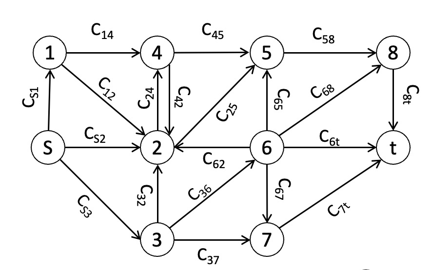

Model: Stochastic Max Flow  (smf)
========================================
Description:
------------
Consider a max-flow problem with source node :math:`s`
and sink node :math:`t` and each arc :math:`i` is associated 
with a capacity :math:`C_i`

An example of a network with 10 total nodes and 20 arcs is shown below

Sources of Randomness:
----------------------
The capacities are scaled by non-negative random variable, which is distributed with Erlang distribution. 

The capacity of arc i to the max-flow solver model would be :math:`1000*assigned\_capacities[i]*scale[i]`, it was scaled up 1000 times since the maxflow solver would only solve for integer flow.

Model Factors:
---------------
* num_nodes: Total number of nodes.

  * Default: 10

* arcs: List of arcs 

  * Default: 20 arcs, [(S,1),(S,2),(S,3),(1,2),(1,4),(2,4),(4,2),(3,2),(2,5),(4,5),(3,6),(3,7),(6,5),(6,7),(5,8),(6,8),(6,t),(7,t),(8,t)]

* source_index": Source node index

  * default: 0

* sink_index: Sink node index
  
  * default: 9

* assigned_capacities: Assigned capacity of each arc

  * default: [5, 5, 5, 5, 5, 5, 5, 5, 5, 5, 5, 5, 5, 5, 5, 5, 5, 5, 5, 5]

          
Responses:
----------
* max_flow: the maximum flow from the source node S to the sink node t (scaled back down 1000 times)
  
  :math:`\sum_{(s,j) \in arcs} \nobreakspace \phi_si \nobreakspace / \nobreakspace 1000`

References:
-----------
No reference

Optimization Problem: Maximize system flow with random noice in capacity (SMF-1)
================================================================================

Decision Variables:
--------------------
* assigned_capacities :math:`x_i`

Objectives:
------------
We want to maximize the expected max flow from the source node s to the sink node t.

The maximum flow of the system, which is the objective function can then be represented 
by the total flow out from the source node, which is 

:math:`f(\phi) = \sum_{(s,i) \in arcs}\nobreakspace \ \phi_si`

Constraints:
------------

* We constrain the total capacity to be allocated over the arcs to be :math:`b`

  * :math:`\sum_{(i,j) \in arcs} \nobreakspace x_ij \nobreakspace\leq \nobreakspace b`

  * :math:`0 \nobreakspace \leq \nobreakspace x_ij\    \  \      \forall (s,i) \in arcs`

Problem Factors:
----------------
* budget: Max # of replications for a solver to take.

    * Default: 10000

* b: Total set-capacity that can be allocated to arcs

    * Default: 100

Fixed Model Factors:
--------------------
* N/A

Starting Solution: 
------------------
* initial_solution: (1,) * 20

Random Solutions: 
-----------------
Sample uniformly from the simplex of :math:`\sum_{(i,j) \in arcs} \nobreakspace x_ij \nobreakspace \leq \nobreakspace b` and :math:`0 \nobreakspace \leq \nobreakspace x_ij\        \forall (s,i) \in arcs`

Optimal Solution:
-----------------
Unknown

Optimal Objective Function Value:
---------------------------------
Unknown