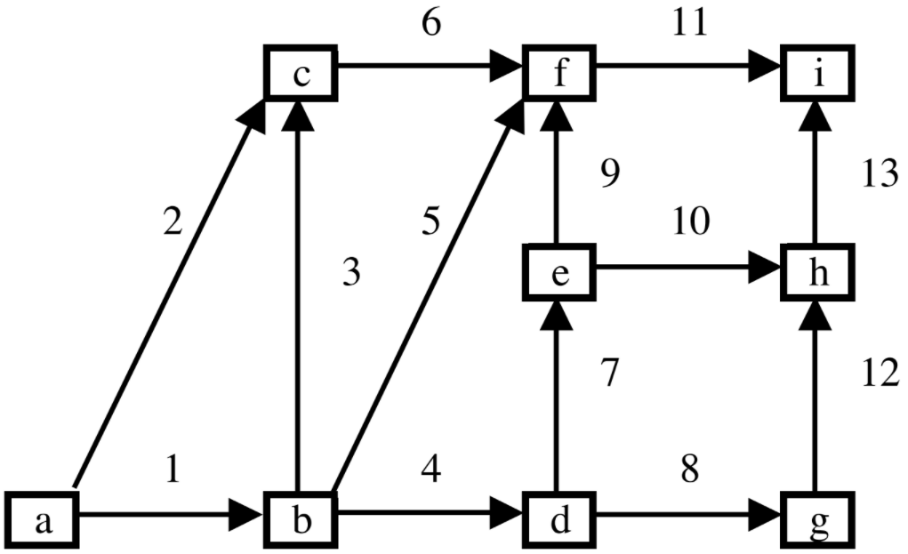

Stochastic Activity Network
===========================

See the :mod:`simopt.models.san` module for API details.

Model: Stochastic Activity Network (SAN)
----------------------------------------

Description
^^^^^^^^^^^

Consider a stochastic activity network (SAN) where each arc :math:`i`
is associated with a task with random duration :math:`X_i`. Task durations
are independent. SANs are also known as PERT networks and are used in planning
large-scale projects. 

An example SAN with 13 arcs is given in the following figure:

Sources of Randomness
^^^^^^^^^^^^^^^^^^^^^

1. Task durations are exponentially distributed with mean :math:`\theta_i`.

Model Factors
^^^^^^^^^^^^^

* num_nodes: Number of nodes.
    * Default: 9
* arcs: List of arcs.
    * Default: [(1, 2), (1, 3), (2, 3), (2, 4), (2, 6), (3, 6), (4, 5),
                (4, 7), (5, 6), (5, 8), (6, 9), (7, 8), (8, 9)]
* arc_means: Mean task durations for each arc.
    * Default: (1, 1, 1, 1, 1, 1, 1, 1, 1, 1, 1, 1, 1)

Responses
^^^^^^^^^

* longest_path_length: Length/duration of the longest path.

References
^^^^^^^^^^

This model is adapted from Avramidis, A.N., Wilson, J.R. (1996).
Integrated variance reduction strategies for simulation. *Operations Research* 44, 327-346.
(https://pubsonline.informs.org/doi/abs/10.1287/opre.44.2.327)

Optimization Problem: Minimize Longest Path Plus Penalty (SAN-1)
----------------------------------------------------------------

Decision Variables
^^^^^^^^^^^^^^^^^^

* arc_means

Objectives
^^^^^^^^^^

Suppose that we can select :math:`\theta_i > 0` for each :math:`i`,
but there is an associated cost. In particular, we want to minimize :math:`ET(\theta) + f(\theta)`,
where :math:`T(\theta)` is the (random) duration of the longest path from :math:`a`
to :math:`i` and :math:`f(\theta) = \sum_{i=1}^{n}\theta_i^{-1}` where :math:`n`
is the number of arcs.

The objective function is convex in :math:`\theta`. An IPA estimator of the gradient
is also given in the code.

Constraints
^^^^^^^^^^^

We require that :math:`theta_i > 0` for each :math:`i`.

Problem Factors
^^^^^^^^^^^^^^^

* budget: Max # of replications for a solver to take.
    * Default: 10000
* arc_costs: Cost associated to each arc.
    * Default: (1, 1, 1, 1, 1, 1, 1, 1, 1, 1, 1, 1, 1)

Fixed Model Factors
^^^^^^^^^^^^^^^^^^^

* N/A

Starting Solution
^^^^^^^^^^^^^^^^^

* initial_solution: (8,) * 13

Random Solutions
^^^^^^^^^^^^^^^^

Sample each arc mean uniformly from a lognormal distribution with 
2.5- and 97.5-percentiles at 0.1 and 10 respectively.

Optimal Solution
^^^^^^^^^^^^^^^^

Unknown

Optimal Objective Function Value
^^^^^^^^^^^^^^^^^^^^^^^^^^^^^^^^

Unknown

Optimization Problem: Minimize Longest Path Plus Penalty with Stochastic Constraints (SAN-2)
--------------------------------------------------------------------------------------------

Decision Variables
^^^^^^^^^^^^^^^^^^

* **arc_means**

Objectives
^^^^^^^^^^

Suppose that we can select :math:`\theta_i > 0` for each :math:`i`, but there is an associated cost.
In particular, we want to minimize:

.. math::

    \mathbb{E}[T(\theta)] + f(\theta),

where :math:`T(\theta)` is the (random) duration of the longest path from node :math:`a` to node :math:`i`, and

.. math::

    f(\theta) = \sum_{i=1}^{n} \theta_i^{-1},

where :math:`n` is the number of arcs.

The objective function is convex in :math:`\theta`.

Constraints
^^^^^^^^^^^

We require that :math:`\theta_i > 0` for each :math:`i`.
Additionally, we allow :math:`n` stochastic constraints that restrict the expected time to reach node :math:`i`, of the form:

.. math::

    \mathbb{E}[T_i(\theta)] \leq a_i.

Problem Factors
^^^^^^^^^^^^^^^

* **budget**: Maximum number of replications the solver is allowed to take.
    *Default:* ``10000``

* **arc_costs**: Cost associated with each arc.
    *Default:* ``(1, 1, 1, 1, 1, 1, 1, 1, 1, 1, 1, 1, 1)``

* **constraint_nodes**: Nodes with corresponding stochastic constraints.
    *Default:* ``[6, 8]``

* **length_to_node_constraint**: Maximum expected length to corresponding constraint nodes.
    *Default:* ``[5, 5]``

Fixed Model Factors
^^^^^^^^^^^^^^^^^^^

* **N/A**

Starting Solution
^^^^^^^^^^^^^^^^^

* **initial_solution**: ``(8,) * 13``

Random Solutions
^^^^^^^^^^^^^^^^

Each arc mean is sampled independently from a lognormal distribution with 2.5th and 97.5th percentiles equal to 0.1 and 10, respectively.

Optimal Solution
^^^^^^^^^^^^^^^^

* **Unknown**

Optimal Objective Function Value
^^^^^^^^^^^^^^^^^^^^^^^^^^^^^^^^

* **Unknown**
