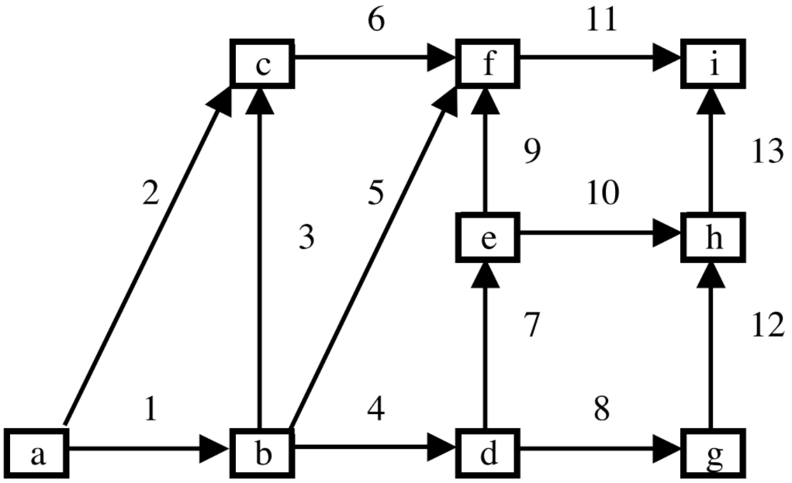

Stochastic Activity Network
===========================

See the :mod:`simopt.models.san` module for API details.

Model: Stochastic Activity Network (SAN)
----------------------------------------

Description
^^^^^^^^^^^

Consider a stochastic activity network (SAN) where each arc :math:`i`
is associated with a task with random duration :math:`X_i`. Task durations
are independent. SANs are also known as PERT networks and are used in planning
large-scale projects. 

An example SAN with 13 arcs is given in the following figure:

Sources of Randomness
^^^^^^^^^^^^^^^^^^^^^

1. Task durations are exponentially distributed with mean :math:`\theta_i`.

Model Factors
^^^^^^^^^^^^^

* num_nodes: Number of nodes.
    * Default: 9
* arcs: List of arcs.
    * Default: [(1, 2), (1, 3), (2, 3), (2, 4), (2, 6), (3, 6), (4, 5),
                (4, 7), (5, 6), (5, 8), (6, 9), (7, 8), (8, 9)]
* arc_means: Mean task durations for each arc.
    * Default: (1, 1, 1, 1, 1, 1, 1, 1, 1, 1, 1, 1, 1)

Responses
^^^^^^^^^

* longest_path_length: Duration of the longest path to the final node.
* longest_path_to_all_nodes: Longest-path durations to all nodes.
* topo_order: Topological ordering of the nodes.

References
^^^^^^^^^^

This model is adapted from Avramidis, A.N., Wilson, J.R. (1996).
Integrated variance reduction strategies for simulation. *Operations Research* 44, 327-346.
(https://pubsonline.informs.org/doi/abs/10.1287/opre.44.2.327)

Shared Optimization Settings
----------------------------

All four problems use ``arc_means`` as continuous decision variables
:math:`\theta`, with dimension equal to the number of arcs (default: 13).
Let :math:`T(\theta)` denote the random longest-path duration from node 1
to the final node, and let :math:`q_i` denote ``arc_costs``.

The following parameters and settings are shared across all problems:

* budget: Maximum solver replications. Default: ``10000``.
* arc_costs: Positive cost coefficients. Default: ``(1,) * 13``.
* initial_solution: Default: ``(8,) * 13``.
* Fixed model factors: None.
* Random solutions: Each arc mean is sampled independently from a lognormal
  distribution with 2.5th and 97.5th percentiles of 0.1 and 10.
* Optimal solution and objective value: Unknown.

Optimization Problem: Minimize Longest Path Plus Penalty (SAN-1)
----------------------------------------------------------------

Objective
^^^^^^^^^

.. math::

    \min_{\theta}\; \mathbb{E}[T(\theta)] + \sum_{i=1}^{n}\frac{q_i}{\theta_i}.

The objective is convex. IPA objective-gradient estimates are available.

Constraints
^^^^^^^^^^^

:math:`\theta_i \geq 0.01` for every arc, with no finite upper bound.

Optimization Problem: Longest Path Plus Penalty with Stochastic Constraints (SAN-2)
-----------------------------------------------------------------------------------

The objective and shared parameters are the same as SAN-1.
IPA objective- and constraint-gradient estimates are available.

Constraints
^^^^^^^^^^^

:math:`0.01 \leq \theta_i \leq 100` for every arc, together with:

.. math::

    \mathbb{E}[T_j(\theta)] \leq a_j,
    \qquad j \in \text{constraint_nodes},

where :math:`T_j(\theta)` is the longest-path duration from node 1 to node
:math:`j`, and :math:`a_j` is its corresponding limit.

Additional Problem Factors
^^^^^^^^^^^^^^^^^^^^^^^^^^

* constraint_nodes: Nodes with stochastic constraints. Default: ``[6, 8]``.
* length_to_node_constraint: Corresponding expected-duration limits.
  Default: ``[5.0, 5.0]``.

Optimization Problem: Minimize Longest Path with Equality Cost Constraint (SAN-3)
---------------------------------------------------------------------------------

Shared parameters and variable bounds are the same as SAN-1.
The problem declares objective gradients unavailable.

Objective
^^^^^^^^^

.. math::

    \min_{\theta}\; \mathbb{E}[T(\theta)].

Constraints
^^^^^^^^^^^

In addition to the variable bounds, impose the deterministic equality:

.. math::

    \sum_{i=1}^{n}\frac{q_i}{\theta_i} - C = 0.

The constraint Jacobian and Hessian are provided analytically.

Additional Problem Factors
^^^^^^^^^^^^^^^^^^^^^^^^^^

* total_cost: Required total cost :math:`C`. Default: ``5.0``.

Optimization Problem: Minimize Longest Path with Inequality Cost Constraint (SAN-4)
-----------------------------------------------------------------------------------

The objective, parameters, variable bounds, and gradient availability are
the same as SAN-3. Replace its equality with the deterministic inequality:

.. math::

    \sum_{i=1}^{n}\frac{q_i}{\theta_i} - C \leq 0.

Here, ``total_cost`` is the maximum allowable cost.
The constraint Jacobian and Hessian are provided analytically.
