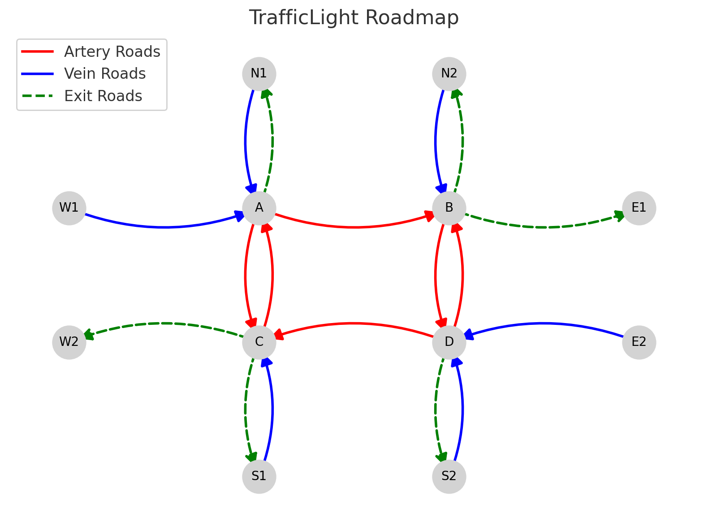

Traffic Signal Configuration
============================

See the :mod:`simopt.models.trafficsignal` module for API details.

Model: Traffic Signal
---------------------

Description
^^^^^^^^^^^

This model simulates a traffic system composed of four intersections (nodes A, B, C, D) connected by directional roads, with eight external arrival nodes.

There are three types of roads in the system:

- **Artery roads** connect intersections to one another and are assigned longer travel lengths.
- **Vein roads** bring vehicles from external arrival points into the system and are assigned shorter travel lengths.
- **Exit roads** lead from intersections to exit nodes and allow vehicles to leave the system.

The layout of the traffic network is shown below:

Each car enters the system through one of six designated arrival nodes. The probability of selecting a given arrival node is proportional to its lambda value:

:math:`\frac{\lambda_i}{\sum_{j=1}^{6} \lambda_j}`

For the selected arrival node, the lambda value is used to generate the distribution of the next car's arrival time. Each car is also randomly assigned a destination node, based on a transition matrix specified by the `"transition_probs"` factor. The default matrix is:

+---+-----+-----+-----+-----+-----+-----+-----+-----+
|   |  1  |  2  |  3  |  4  |  5  |  6  |  7  |  8  |
+===+=====+=====+=====+=====+=====+=====+=====+=====+
| 1 | 0   | 0   | 0   | 0   | 0   | 0.7 | 0.3 | 0   |
+---+-----+-----+-----+-----+-----+-----+-----+-----+
| 2 | 0.3 | 0   | 0.2 | 0   | 0.3 | 0   | 0.2 | 0   |
+---+-----+-----+-----+-----+-----+-----+-----+-----+
| 3 | 0   | 0   | 0   | 0   | 0   | 0   | 0   | 0   |
+---+-----+-----+-----+-----+-----+-----+-----+-----+
| 4 | 0.25| 0.25| 0.1 | 0   | 0.25| 0   | 0.15| 0   |
+---+-----+-----+-----+-----+-----+-----+-----+-----+
| 5 | 0   | 0.7 | 0.3 | 0   | 0   | 0   | 0   | 0   |
+---+-----+-----+-----+-----+-----+-----+-----+-----+
| 6 | 0.3 | 0   | 0.2 | 0   | 0.3 | 0   | 0.2 | 0   |
+---+-----+-----+-----+-----+-----+-----+-----+-----+
| 7 | 0   | 0   | 0   | 0   | 0   | 0   | 0   | 0   |
+---+-----+-----+-----+-----+-----+-----+-----+-----+
| 8 | 0.25| 0   | 0.15| 0   | 0.25| 0.25| 0.1 | 0   |
+---+-----+-----+-----+-----+-----+-----+-----+-----+

Each vehicle finds the shortest available path to its destination using the current road network. The traffic system opens at 8:00 AM and closes at 10:00 AM. Time is measured in seconds. When the system closes, any remaining cars in the queue exit immediately.

Sources of Randomness
^^^^^^^^^^^^^^^^^^^^^

There are 3 sources of randomness in this model:

1. The probability of selecting a given arrival node is:

   :math:`\frac{\lambda_i}{\sum_{j=1}^{6} \lambda_j}`

   where :math:`\lambda_i` is the arrival rate for node *i*.
2. The arrival time of the **first car** is fixed at 1 second. The arrival times of subsequent cars follow an exponential distribution with rate parameter :math:`\lambda_i`, where *i* is the index of the arrival node selected for the **previous** car.
3. The probability for each node to selected as the destination for cars from different arrival nodes.

+---+-----+-----+-----+-----+-----+-----+-----+-----+
|   |  1  |  2  |  3  |  4  |  5  |  6  |  7  |  8  |
+===+=====+=====+=====+=====+=====+=====+=====+=====+
| 1 | 0   | 0   | 0   | 0   | 0   | 0.7 | 0.3 | 0   |
+---+-----+-----+-----+-----+-----+-----+-----+-----+
| 2 | 0.3 | 0   | 0.2 | 0   | 0.3 | 0   | 0.2 | 0   |
+---+-----+-----+-----+-----+-----+-----+-----+-----+
| 3 | 0   | 0   | 0   | 0   | 0   | 0   | 0   | 0   |
+---+-----+-----+-----+-----+-----+-----+-----+-----+
| 4 | 0.25| 0.25| 0.1 | 0   | 0.25| 0   | 0.15| 0   |
+---+-----+-----+-----+-----+-----+-----+-----+-----+
| 5 | 0   | 0.7 | 0.3 | 0   | 0   | 0   | 0   | 0   |
+---+-----+-----+-----+-----+-----+-----+-----+-----+
| 6 | 0.3 | 0   | 0.2 | 0   | 0.3 | 0   | 0.2 | 0   |
+---+-----+-----+-----+-----+-----+-----+-----+-----+
| 7 | 0   | 0   | 0   | 0   | 0   | 0   | 0   | 0   |
+---+-----+-----+-----+-----+-----+-----+-----+-----+
| 8 | 0.25| 0   | 0.15| 0   | 0.25| 0.25| 0.1 | 0   |
+---+-----+-----+-----+-----+-----+-----+-----+-----+

Model Factors
^^^^^^^^^^^^^

* lambdas: Rate parameter of the time interval distribution, in seconds, for generating each car.  
    * Default: [2, 2, 0, 1, 2, 2, 0, 1]
* runtime: The number of seconds that the traffic model runs.
    * Default: 7200
* numintersections: The number of intersections in the traffic model.
    * Default: 4
* decision_vector: Delay, in seconds, in light schedule based on distance from first intersection.
    * Default: [1, 2, 3]
* speed: Constant speed in meter/second for the cars.
    * Default: 5
* carlength: Length in meters of each car.
    * Default: 4.5
* reaction: Reaction time in seconds of cars in queue.
    * Default: 0.1
* transition_probs: The transition probability of a car end at each point from their current starting point.
    * Default: [0.7, 0.3, 0.3, 0.2, 0.25, 0.1, 0.15]
* pause: The pause in seconds before move on a green light.
    * Default: 0.1
* car_distance: The distance between cars.
    * Default: 0.5
* length_arteries: The length in meters of artery roads between each intersection or node.
    * Default: 100
* length_veins: The length in meters of vein roads between each intersection or node.
    * Default: 100
* redlight_arteries : The length of redlight duration of artery roads in each intersection.
    * Default: [10, 10, 10, 10]
* redlight_veins : The length of redlight duration of vein roads in each intersection.
    * Default : [20, 20, 20, 20]

Responses
^^^^^^^^^

* WaitingTime: The average queuing time of the number of cars in the model
* SystemTime: The average time of the number of cars arriving the destination in the model
* AvgQueueLen: The average queue length of the number of cars in the model 
* OverflowPercentage: The ratio of overflow time to total system time.
* OverflowPercentageOver51: Whether the overflow time is larger than 51% of the total system time.

References
^^^^^^^^^^

This model are adapted from the following articles: 

Ito, H., K. Tsutsumida., T. Matsubayashi., T, Kurashima., and H, Toda. (2019). Coordinated traffic signal control via bayesian optimization for hierarchical conditional spaces. Proceedings of the 2019 Winter Simulation Conference, 3645–3656.

Osorio, C., and L, Chong. (2012). An efficient simulation-based optimization algorithm for large-scale transportation problems. Proceedings of the 2012 Winter Simulation Conference, 1–11.

Optimization Problem: Minimize Waiting Time (MinWaitingTime-1)
--------------------------------------------------------------

Decision Variables
^^^^^^^^^^^^^^^^^^

* decision_vector

Objectives
^^^^^^^^^^

Minimize average queueing time for each car in the system.

Constraints
^^^^^^^^^^^

* :math:`lambda_i`> 0 for each i.

Problem Factors
^^^^^^^^^^^^^^^

* Budget: Max # of replications for a solver to take.
    * Default: 1000

Fixed Model Factors
^^^^^^^^^^^^^^^^^^^

N/A

Starting Solution
^^^^^^^^^^^^^^^^^

* decision_vector = [1, 2, 3]

Random Solutions
^^^^^^^^^^^^^^^^

Generate a solution from a space of vectors of length 3.

Optimal Solution
^^^^^^^^^^^^^^^^

Unknown.

Optimal Objective Function Value
^^^^^^^^^^^^^^^^^^^^^^^^^^^^^^^^

Unknown.