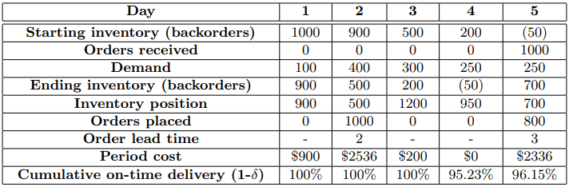

(s,S) Inventory System
======================

This example is adapted (almost verbatim) from the article Kleijnen, J.P.C. et al. Constrained Optimization in Simulation: A Novel Approach, Discussion Paper 2008-95, Tilburg University, Center for Economic Research.

Consider a (s,S) inventory model with full backlogging. Demand during each period, :math:`D_t` is distributed
exponential with mean :math:`\mu`. At the end of each period, the inventory position :math:`(IP_t = \text{Stock on hand} -
\text{Backorders + Outstanding Orders})` is calculated and, if it is below :math:`s`, an order to get back up to :math:`S` is placed :math:`(O_t = \max(\mathbb{I}(IP_t < s)(S − IP_t), 0)`. Lead times have a Poisson distribution with mean :math:`\theta` days and all
replenishment orders are received at the beginning of the period. Note that, since orders are placed at the
end of the day, an order with lead time :math:`l` placed in period :math:`n` will arrive at the beginning of period :math:`n + l + 1`.

A per unit holding cost :math:`h` is charged for inventory on-hand; furthermore, there is a fixed order cost :math:`f`
and a variable, per unit, cost :math:`c`. Our goal is to find :math:`s` and :math:`S` in order to minimize the :math:`\mathbb{E}[\text{Total cost per period}]` such that the stockout rate :math:`\delta`, the fraction of demand not supplied from stock on-hand, is at most
:math:`10\%`. To further clarify the order of events and the calculation of costs, a 5-day example in which :math:`s = 1000`
and :math:`S = 1500`, the initial inventory on hand is :math:`1000` and there are no outstanding orders is provided below.

*Recommended Parameter Settings:* Take :math:`\mu = 100`, :math:`\theta = 6`, :math:`h = 1`, :math:`f = 36` and :math:`c = 2`.

*Starting Solutions:* :math:`s = 1000`, :math:`S = 2000`. 

If multiple solutions are needed, use :math:`s ∼Uniform(700,1000)`, :math:`S ∼Uniform(1500,2000)`.

*Measurement of Time:* Days simulated

*Optimal Solution:* Unknown

.. examples of using math, first is for centered math on its own line, second is for inline

.. .. math::

   \frac{ \sum_{t=0}^{N}f(t,k) }{N}
   
.. Since Pythagoras, we know that :math:`\frac{ \sum_{t=0}^{N}f(t,k) }{N}`