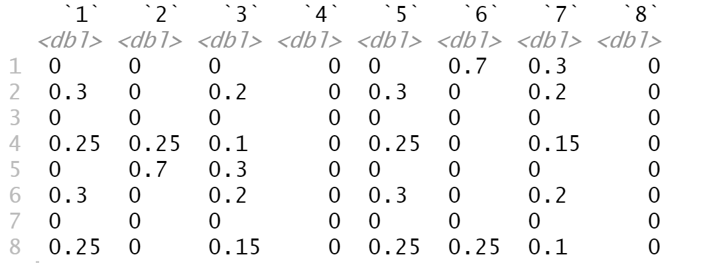

Model: Traffic Signal
==========================================

This model simulates a traffic model that composed of four roads that intersect each other perpendicularly and the model has 8 arrival nodes. The two horizontal roads are called vein roads which are 1-way, and these two roads have an opposite direction, and the two vertical roads are called artery roads which are 2-way. The probablity for each of the six possible nodes to be selected as the arrival node is :math:`{\lambda_i}{\sum_{i=1}^{6}\lambda_i}`. For the node selected for an arrival, use its lambda value to generate distribution of the next arrival time.

According to the arrival node, each car will be randomly generated a destination based on the transition matrix generated by the factor "transition_probs". The default transistion matrix is:

Cars will automatically find the shortest road to arrive its destination. The traffic system opens at 8AM and closes at 10AM, and time is measured in seconds.
When the traffic system closes, all cars in the queue leave immediately.

Sources of Randomness:
----------------------
There are 3 sources of randomness in this model:

* The probability for each node to be selected as the arrival node is :math:`{\lambda_i}{\sum_{i=1}^{6}\lambda_i}`.

* The arrival time of the first car is always happening at 1 second. The arrival time of the cars (except the first car) as an exponential distribution with :math:`lambda_i`, :math:`i = 1,. . . , 6` that was selected as the arrival node for its previous car. 

* The probability for each node to selected as the destination for cars from different arrival nodes.

Model Factors:
--------------
* lambdas: Rate parameter of the time interval distribution, in seconds, for generating each car.
               
    * Default: [2, 2, 0, 1, 2, 2, 0, 1]

* runtime: The number of seconds that the traffic model runs.

    * Default: 7200
      
* numintersections: The number of intersections in the traffic model.

    * Default: 4

* decision_vector: Delay, in seconds, in light schedule based on distance from first intersection.

    * Default: [1, 2, 3]
            
* speed: Constant speed in meter/second for the cars.

    * Default: 5

* carlength: Length in meters of each car.

    * Default: 4.5
                    
* reaction: Reaction time in seconds of cars in queue.

    * Default: 0.1

* transition_probs: The transition probability of a car end at each point from their current starting point.

    * Default: [0.7, 0.3, 0.3, 0.2, 0.25, 0.1, 0.15]
                                        
* pause: The pause in seconds before move on a green light.

    * Default: 0.1
                     
* car_distance: The distance between cars.

    * Default: 0.5
                      
* length_arteries: The length in meters of artery roads between each intersection or node.

    * Default: 100
            
* length_veins: The length in meters of vein roads between each intersection or node.

    * Default: 100

* redlight_arteries : The length of redlight duration of artery roads in each intersection.

    * Default: [10, 10, 10, 10]
            
* redlight_veins : The length of redlight duration of vein roads in each intersection.

    * Default : [20, 20, 20, 20]

Responses:
----------
* WaitingTime: The average queuing time of the number of cars in the model
* SystemTime: The average time of the number of cars arriving the destination in the model
* AvgQueueLen: The average queue length of the number of cars in the model 
* OverflowPercentage: The ratio of overflow time to total system time.
* OverflowPercentageOver51: Whether the overflow time is larger than 51% of the total system time.

References:
===========
This model are adapted from the following articles: 

Ito, H., K. Tsutsumida, T. Matsubayashi, T. Kurashima, and H. Toda. (2019). Coordinated traffic signal control via bayesian optimization for hierarchical conditional spaces. Proceedings of the 2019 Winter Simulation Conference, 3645–3656.

Osorio, C., and L. Chong. (2012). An efficient simulation-based optimization algorithm for large-scale transportation problems. Proceedings of the 2012 Winter Simulation Conference, 1–11.

Optimization Problem: Minimize Waiting Time (MinWaitingTime-1)
====================================================================

Decision Variables:
-------------------
* decision_vector

Objectives:
-----------
Minimize average queueing time for each car in the system.

Constraints:
------------
* :math:`lambda_i`> 0 for each i.

Problem Factors:
----------------
* Budget: Max # of replications for a solver to take.

  * Default: 1000

Fixed Model Factors:
--------------------
* N/A

Starting Solution:
------------------
* decision_vector = [1, 2, 3]

Random Solutions:
------------------
Generate a solution from a space of vectors of length 3.

Optimal Solution:
-----------------
unknown

Optimal Objective Function Value:
---------------------------------
unknown
