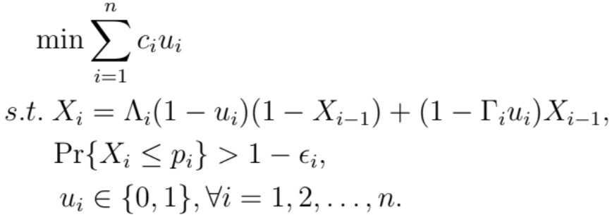

Contamination Control Problem
=============================

Prepared by Kaeyoung Shin and Raghu Pasupathy of Virginia Tech, 12/18/2010.
This example is adapted from the article by Y. Hu et al. [1]

Consider a food supply chain consisting of :math:`n` stages. Suppose there exists
a possibility that pathogenic microorganisms and other poisonous elements contaminate
some fraction of the food supply at each stage. Specifically, let the growth rate
of contamination at the stage :math:`i` of the chain be denoted by the random variable
:math:`\Lambda_i`, :math:`0 \leq \Lambda_i \leq 1` for :math:`i = 1, 2, ..., n. If
a prevention effort is made at the stage :math:`i`, the contamination decreases by
the random rate :math:`\Gamma_i`, :math:`0 \leq \Gamma_i \leq 1` with associated
prevention cost :math:`c_i`. Let the prevention decision variable :math:`u_i = 1`
if a prevention measure is executed at the stage :math:`i`, and :math:`u_i = 0` otherwise.
Suppose it is stipulated that the contaminated fraction :math:`X_i` at the stage :math:`i`
should not exceed a pre-specified upper limit :math:`p_i` with probability at least
:math:`1 - \epsilon_i`. The goal is to efficiently control contamination in the food
supply chain by solving the following problem:

(Binary vector variables, constrained.)

*Recommended Parameter Settings:*
1. Contamination rate :math:`\Lambda_i ~ Beta(1, \frac{17}{3})` for :math:`i = 1, 2, ..., n`;
2. Restoration rate :math:`\Gamma_i ~ Beta(1, \frac{3}{7})` for :math:`i = 1, 2, ..., n`;
3. Error probability :math:`\epsilon_i = 0.05` for :math:`i = 1, 2, ..., n`;
4. Upper threshold for contamination :math:`p_i = 0.1`;
5. Initial contamination fraction :math:`X_1 ~ Beta(1, 30); and
6. Number of stages :math:`n = 5`.

*Starting Solution(s):* :math:`\u_i = 0` for :math:`i = 1, 2, ..., n`.

*Measurement of Time:* Number of generations of the random variables :math:`\Lambda_i` and :math:`\Gamma_i`.

*Recommended Budgets:* None.

*Optimal Solution:* Unknown.

*Known Structure:* None.

*References:* [1] Y. Hu, J. Hu, Y. Xu, and F. Wang. Contamination control in food supply
chain. In *Proceedings of the 2010 Winter Simulation Conference*, 2010.