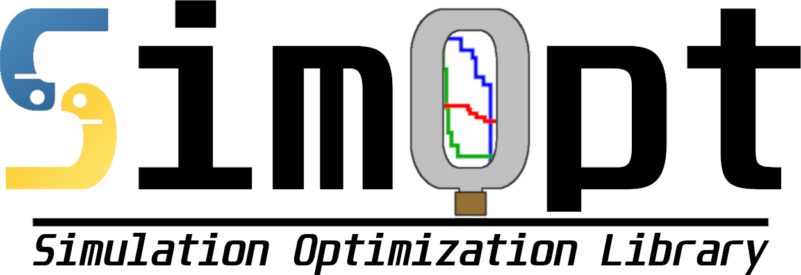
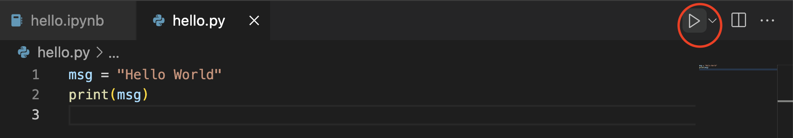
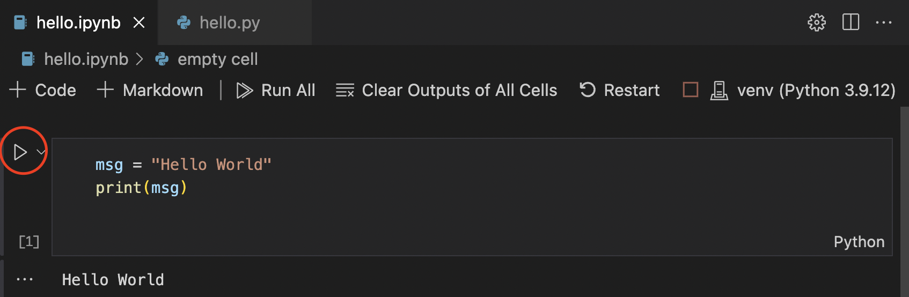
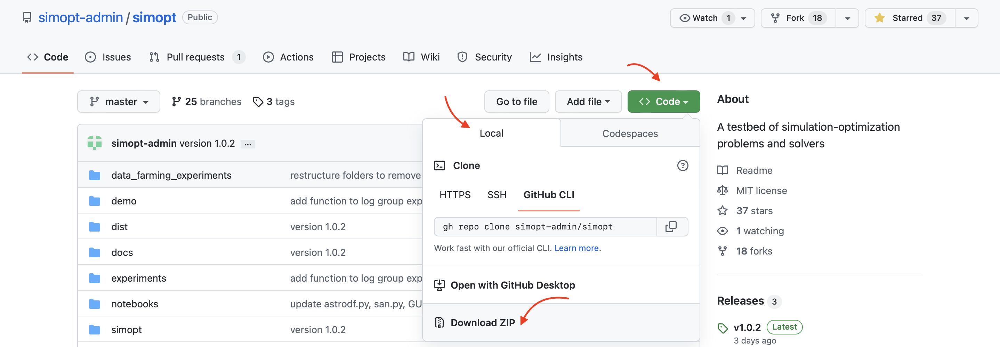

# Welcome to 2025 Winter Simulation Conference SimOpt Workshop!

The SimOpt Workshop is taking place in-person in on Sunday, December 7 from 9am-noon.

SimOpt is a testbed of simulation-optimization problems and solvers. Its purpose is to encourage the development and constructive comparison of simulation-optimization (SO) solvers (algorithms). We are particularly interested in the finite-time performance of solvers, rather than the asymptotic results that one often finds in related literature.

The most-up-to-date publication about this library is [Eckman et al. (2023)](https://pubsonline.informs.org/doi/10.1287/ijoc.2023.1273).

## Before Workshop
Before attending the workshop please follow the instructions below:

1. Install [miniconda](https://www.anaconda.com/docs/getting-started/miniconda/install#quickstart-install-instructions) (make sure you follow every step on the page for your operating system and `conda init --all` is run). After installation, close and reopen your terminal.

2. Set up a new Python virtual environment: `conda create -n simopt python=3.13`. This creates a new environment named `simopt` with Python 3.13 installed.

3. Activate the virtual environment and install Python packages:
```bash
conda activate simopt
pip install jupyterlab simoptlib
```

4. Install Microsoft's [Visual Studio Code (VS Code) IDE](https://code.visualstudio.com).

5. Install the [Python extension for VS Code](https://marketplace.visualstudio.com/items?itemName=ms-python.python) and [Jupyter extension](https://marketplace.visualstudio.com/items?itemName=ms-toolsai.jupyter) from the Visual Studio Marketplace.

6. On your local hard drive, create a folder named `simopt_folder` somewhere convenient and open this folder in VS Code (click "Yes, I trust the authors" if a dialog shows up).

7. In VS Code, go to the File menu and select “Open Folder…” and open the folder you created. That folder will become your VSCode workspace.

8. Test the python interpreter:

* In the Explorer panel of VSCode editor click on the New File icon, and type `hello.py`.


* In the new file in the next panel, type:
```python
msg = "Hello World"
print(msg)
```

* **Important!** Use the **Python: Select Interpreter** command from the Command Palette `(⇧⌘P)` to select the newly created `simopt` environment.

* Hit run (the triangular play button) at the top right corner of the file.
 You should see Hello World printed in the terminal.

9. Test Jupyter notebook in VS Code:

* In the VS Code editor, click on the add new file icon, and type `hello.ipynb`.

* In the new notebook file, click `Add code cell` button and type:
 ```python
msg = "Hello World"
print(msg)
```

* Hit run icon on the left side of the block in the notebook.
 When a Select kernel dialog shows up, click `Python Environments` and then `simopt`. Click the run icon again, Hello World should be printed below the cell.

Congratulations! You have successfully set up the environment needed for the workshop.

(There will an opportunity to do these last two steps during the workshop, but you can also attempt them beforehand.)

10. Open a terminal inside VSCode by clicking on Terminal > New Terminal from the menu. Inside the terminal, type the following to run the GUI: 

```bash
conda activate simopt
python -m simopt
```

* A pop-up window with the GUI should open. You can close it.

11. In your browser, navigate to [https://github.com/simopt-admin/simopt](https://github.com/simopt-admin/simopt). Click on "Download ZIP" as shown.



Unzip the folder **simopt-master** and open it in VS Code using `File > Open Folder`. Click "Yes, I trust the authors" if a dialog shows up.

Open the file `workshop/workshop.ipynb` in the VS Code editor and follow along. You may need to select the `simopt` virtual environment as in Step 8.

## Admins
The core development team currently consists of

- [**David Eckman**](https://eckman.engr.tamu.edu) (Texas A&M University)
- [**Sara Shashaani**](https://shashaani.wordpress.ncsu.edu) (North Carolina State University)
- [**Shane Henderson**](https://people.orie.cornell.edu/shane/) (Cornell University)
- [**Cen Wang**](https://cenwangumass.github.io/) (Texas A&M University)


## Citation
To cite this work, please use
```
@misc{simoptgithub,
  author = {D. J. Eckman and S. G. Henderson and S. Shashaani and R. Pasupathy},
  title = {{SimOpt}},
  year = {2023},
  publisher = {GitHub},
  journal = {GitHub repository},
  howpublished = {\url{https://github.com/simopt-admin/simopt}},
  commit = {4c5de2e7576a596ea20979636cb034e75fada3f4}
}
```

## Acknowledgments
An earlier website for SimOpt, [http://www.simopt.org](http://www.simopt.org), was developed through work supported by the National Science Foundation under grant nos. DMI-0400287, CMMI-0800688 and CMMI-1200315.
Recent work on the development of SimOpt has been supported by the National Science Foundation under grant nos. DGE-1650441, CMMI-1537394, CMMI-1254298, CMMI-1536895, CMMI-2226347, CMMI-2206972, CMMI-2035086, IIS-1247696, and TRIPODS+X DMS-1839346, by the Air Force Office of Scientific Research under grant nos. FA9550-12-1-0200, FA9550-15-1-0038, and FA9550-16-1-0046, and by the Army Research Office under grant no. W911NF-17-1-0094.
Any opinions, findings and conclusions or recommendations expressed in this material are those of the authors and do not necessarily reflect the views of the National Science Foundation (NSF).
